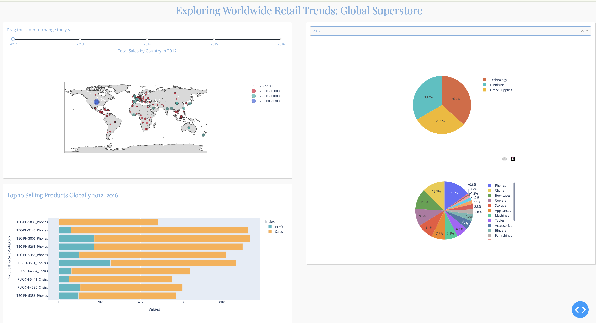

# Dash-App

This dashboard offers visual insights into customer demographics and geographic trends, providing a breakdown of sales for each category and top subcategories. By examining these visualizations, users can make data-driven decisions regarding customer demographics and prioritize strategies for best-selling items.

### Installation & Run

pip3 install dash==2.15.0 dash-core-components==2.0.0 dash-html-components==2.0.0 dash-table==5.0.0
python3 app.py

1. [Dataset](https://www.kaggle.com/datasets/endofnight17j03/global-superstore)

    The Global Superstore dataset provides a comprehensive overview of retail operations, encompassing sales data, product information, customer demographics, and geographic trends. It offers insights into product performance, customer preferences, and regional sales patterns, enabling retailers to optimize inventory management and tailor marketing strategies. By analyzing this dataset, retailers can make informed decisions to drive growth, enhance customer satisfaction, and improve operational efficiency in the competitive retail landscape.

2. Dashboard preview (WIP)
